Catering

Catering is a Spring Boot–based web application for catering services. 
The project allows users to browse the homepage, about page, and menu, submit requests via a contact form, manage their orders, and receive invoices by email in PDF format.

Additional features
- Contact form with server validation
- Display of messages about successful actions without reloading the page
- Secure authentication and authorisation
- Role differentiation (USER / ADMIN)
- Clean MVC architecture
- Adaptive and neat page design

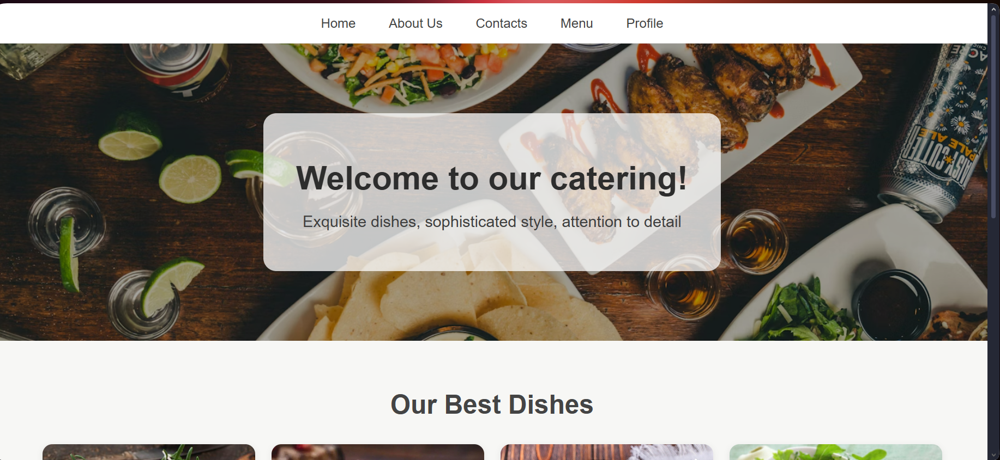
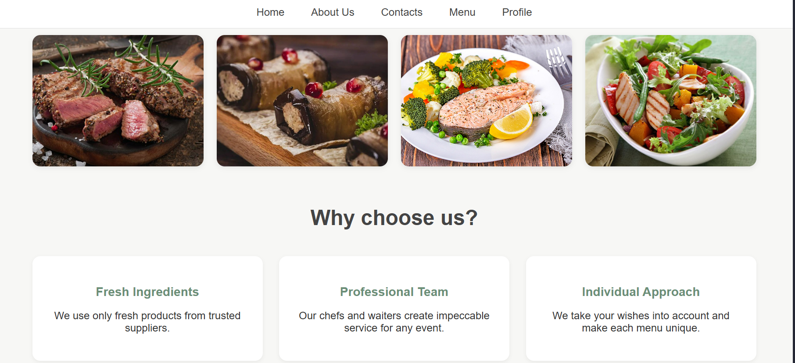
Home page

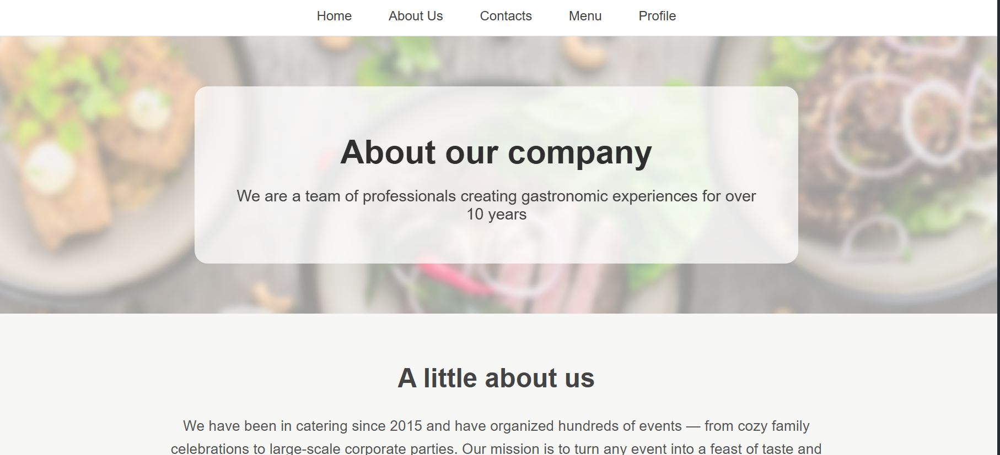

About Us page

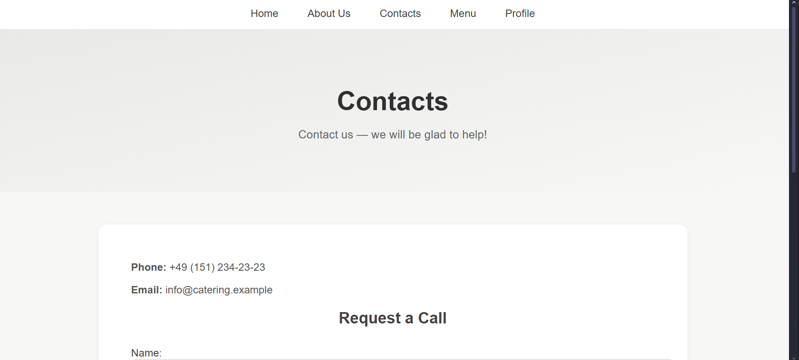
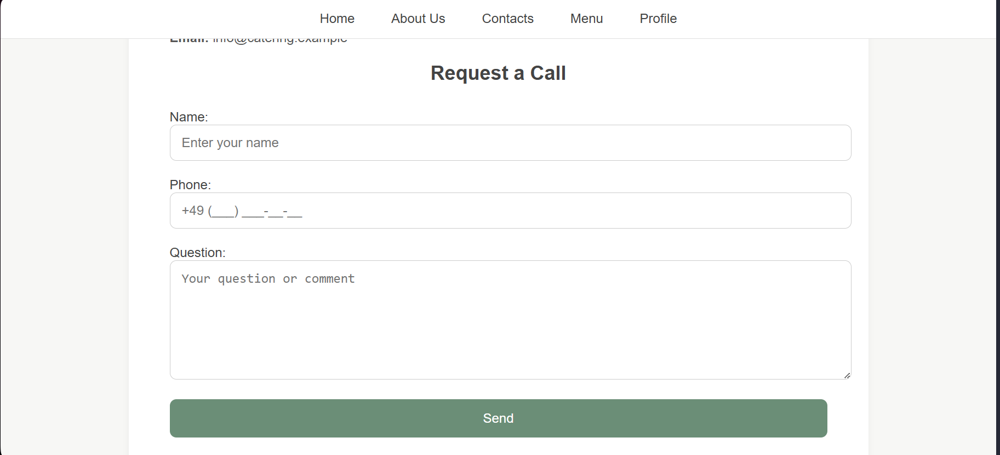
Contacts page

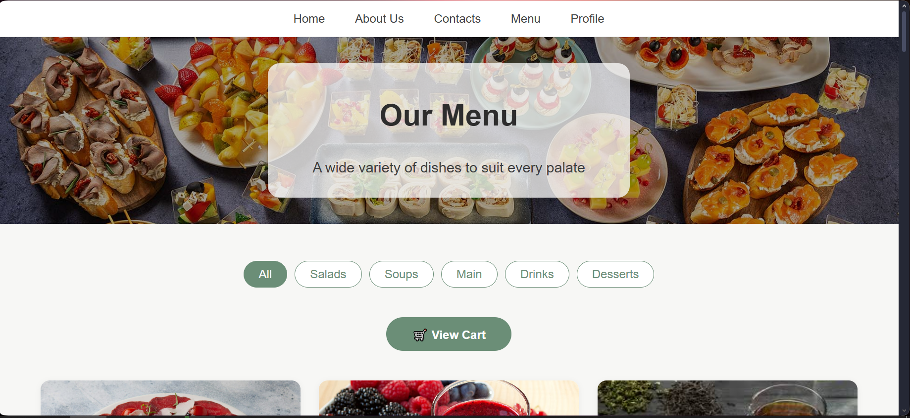
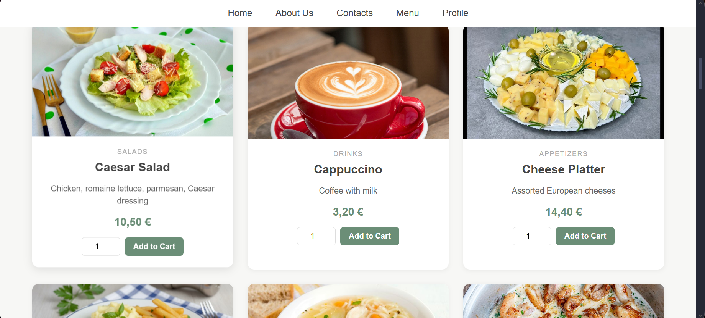
Menu page

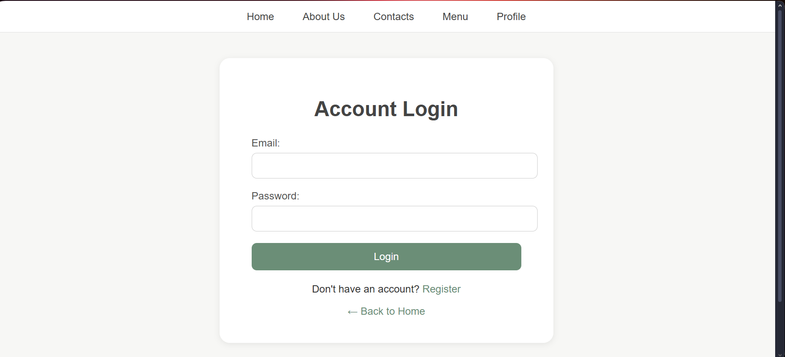
Login page

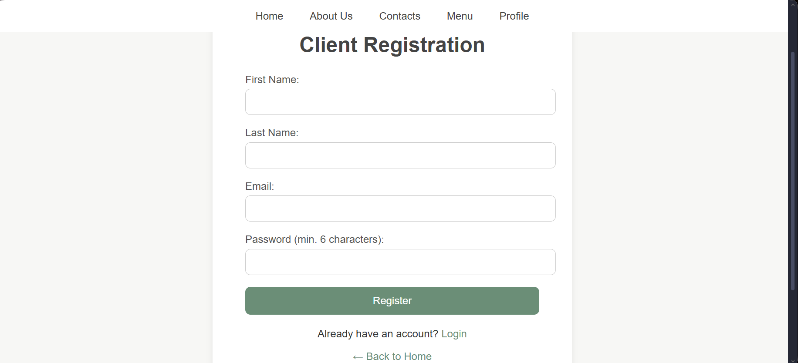
Register page

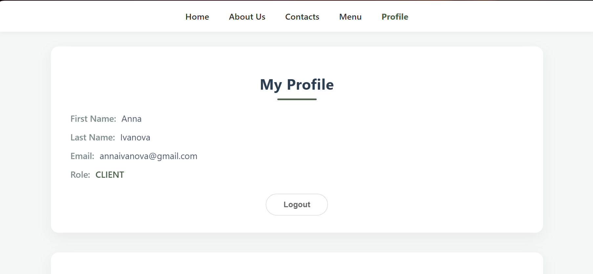
Profile page(User)

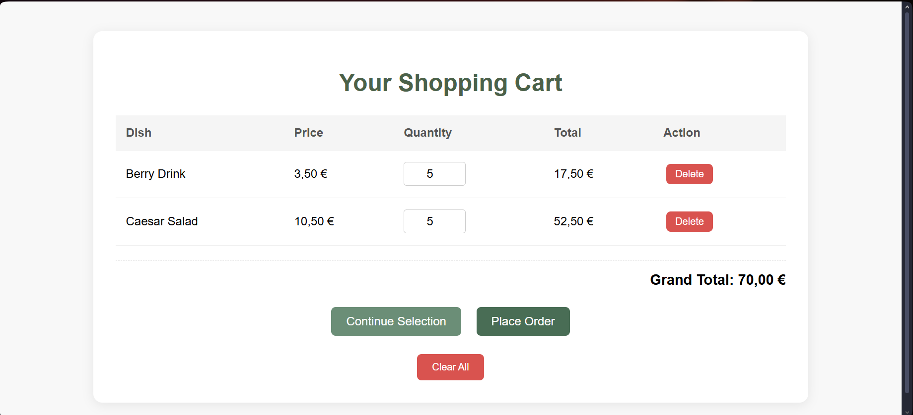
Cart page

Order page

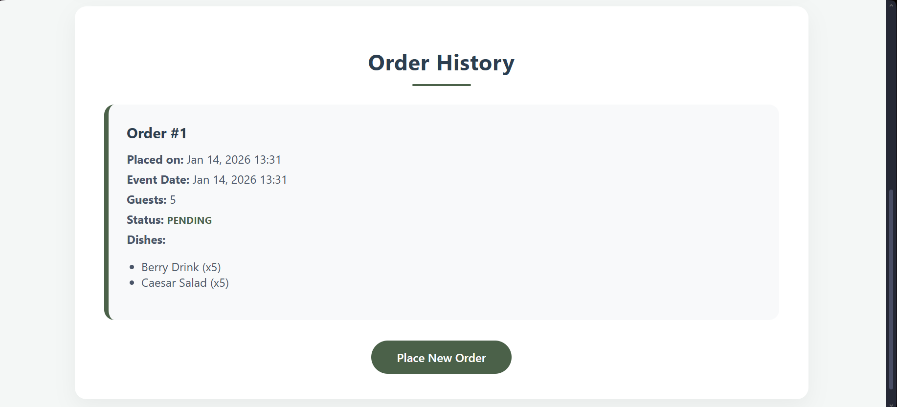
Profile page(Order History)

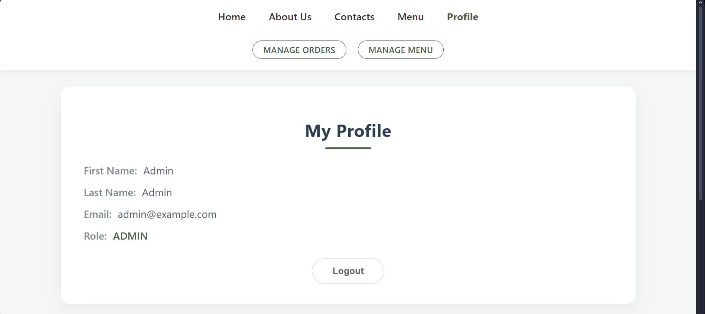
Profile page(Admin)

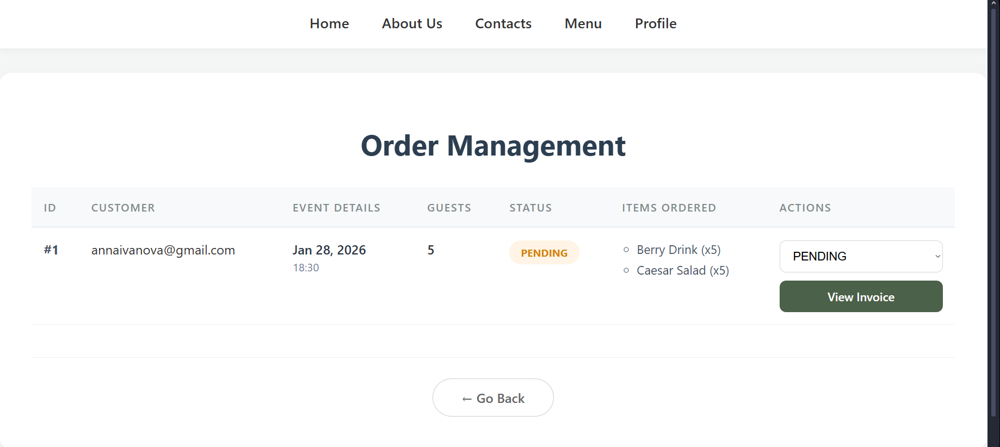
Admin/orders page

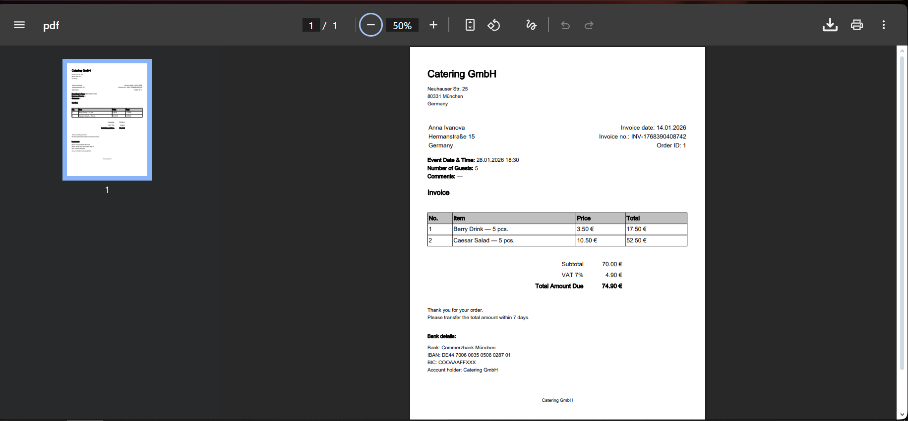
Invoice page

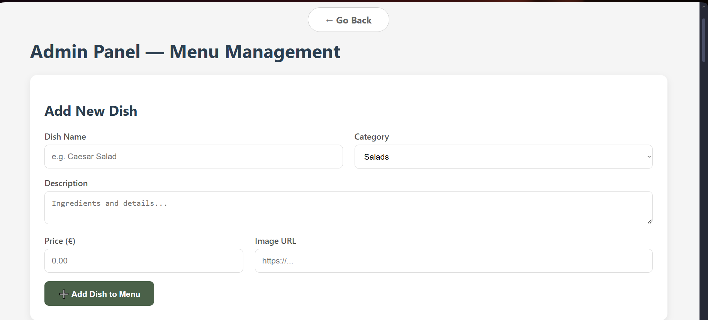
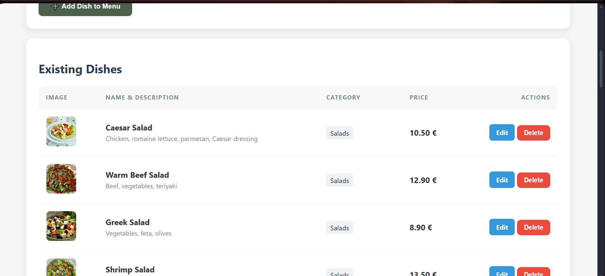
Admin/menu page

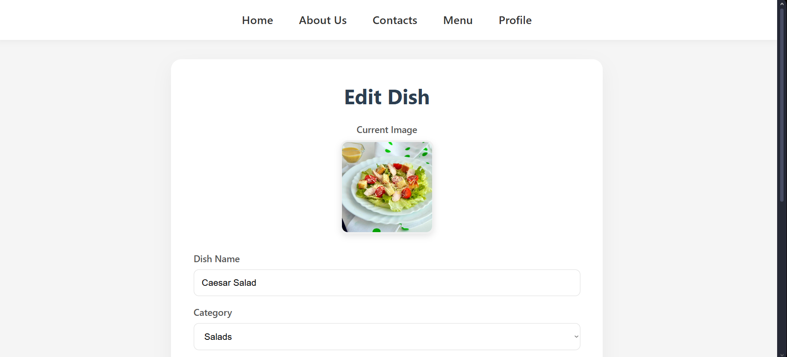
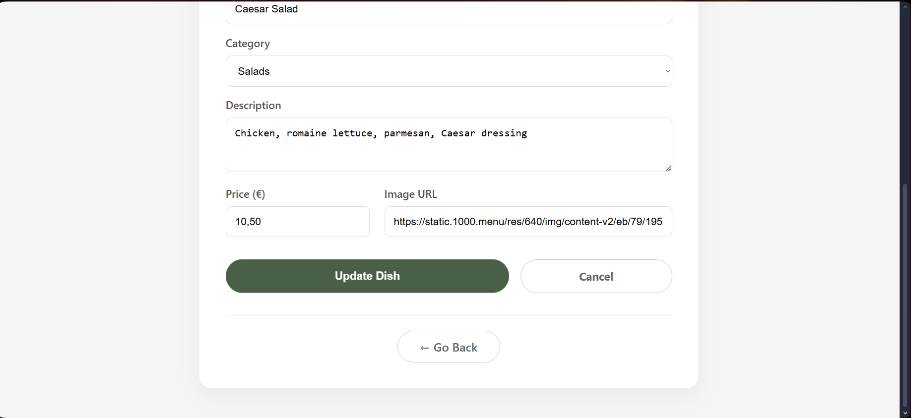
Admin/menu/edit page

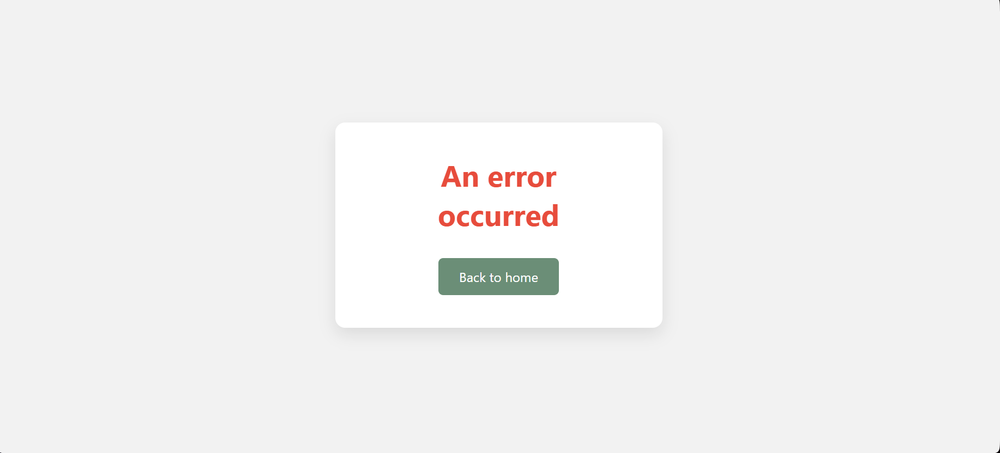
Error page

Technologies
- Java: 21
- Spring Boot: 3.3.5
- Spring MVC: 6.x 
- Spring Security: 6.x
- Spring Data JPA: 3.x
- Hibernate: 6.x
- Thymeleaf: 3.x
- Thymeleaf Extras (Spring Security): 3.1.x
- Spring Validation: 3.x
- Maven: 3.9+
- HTML5 / CSS3
- JavaScript: Basic
- H2 Database: Runtime (development)
- JavaMailSender: Spring Boot Starter Mail
- PDF Generation: iText 7.2.5 (Invoice generation)

User capabilities:
- View the main page with general information about the service
- Read the ‘About us’ page
- View the catering menu
- Send requests via the contact form
- Register and log in to the system
- Create catering orders
- View their order history
- Receive invoices by email in PDF format

Administrator capabilities:
- Access the admin panel
- View a list of all users
- Manage user orders
- Change order status
- Generate and send invoices in PDF format and view them
- Manage the menu (add, edit, delete items)
- Control user and order data

How to run the project:
1. Clone the repository `git clone https://github.com/NataliiaUdynska/catering.git`
2. Navigate `cd catering`
3. Run `mvn spring-boot:run`
3. Open `http://localhost:8080`